<div align="center">
  
  <!-- Animated Header -->
  
  
  <!-- Typing Animation -->
  
  
</div>

---

<div align="center">

## 🎯 WHO AM I?

<table>
<tr>
<td>

</td>
<td>

```yaml
name: Soumabrata Ghosh
located_in: Howrah, India
current_company: [Your company]
current_role: [Your role]
education: [Your education]
website: [Your website]

currently_learning: App Development, Data Structures and Algorithm
2024_goal: Make meaningful websites to help the world and make the web more beautiful. Also contribute to the opensource community.
hobbies: Reading books, Watching Movies & Series, Football, Cricket
```

</td>
</tr>
</table>

</div>

---

<div align="center">

## 🚀 TECH STACK & TOOLS


<br/><br/>

<!-- Programming Languages -->
 **Languages I Speak:**


</div>

---

<div align="center">

## 📊 GITHUB ANALYTICS


<br/>


</div>

---

<div align="center">

## 🏆 ACHIEVEMENTS & TROPHIES


</div>

---

<div align="center">

## 💼 FEATURED PROJECTS

<table>
<tr>
<td width="50%">


### 🎨 LinguChat

[Your projectDescription1]

**Tech Stack:** `JavaScript, NodeJs, Lingo.dev, Socket.io`

[]([Your projectLink1])
[]([Your projectRepo1])

</td>
<td width="50%">


### 🚀 PostMee

[Your projectDescription2]

**Tech Stack:** `React, NodeJs, Express, Appwrite`

[]([Your projectLink2])
[]([Your projectRepo2])

</td>
</tr>
<tr>
<td width="50%">


### 🔥 Stellarium

[Your projectDescription3]

**Tech Stack:** `Html5, Css3, JavaScript`

[]([Your projectLink3])
[]([Your projectRepo3])

</td>
<td width="50%">


### ⚡ [Your projectName4]

[Your projectDescription4]

**Tech Stack:** `[Your projectStack4]`

[]([Your projectLink4])
[]([Your projectRepo4])

</td>
</tr>
</table>

</div>

---

<div align="center">

## 🎯 CURRENT FOCUS

```mermaid
graph LR
    A[🔭 Currently Working On] --> B[Building an Video Sharing and Streaming platform where users can share videos and stream live and also can watch videos.]
    C[🌱 Learning] --> D[App Development, Data Structures and Algorithm]
    E[💬 Ask Me About] --> F[Full Stack Development]
    G[⚡ Fun Fact] --> H[[Your funFact]]
    
    style A fill:#ff6b6b
    style C fill:#4ecdc4
    style E fill:#45b7d1
    style G fill:#96ceb4
```




</div>

---

<div align="center">

## 📈 CONTRIBUTION GRAPH


</div>

---

<div align="center">

## 🌐 CONNECT WITH ME


[]([Your website])
[](https://linkedin.com/in/[Your linkedinUsername])
[](https://twitter.com/[Your twitterUsername])
[](https://instagram.com/[Your instagramUsername])
[](https://youtube.com/[Your youtubeChannel])
[](mailto:soumabrataghosh57@gmail.com)

### 💬 Let's Talk About:
- 🔥 Web Development & Modern Frameworks
- 🤖 AI/ML & Data Science
- 🎨 UI/UX Design Principles
- 🚀 Startup Ideas & Innovation
- 📚 Tech Books & Learning Resources

</div>

---

<div align="center">

## 📊 WEEKLY DEVELOPMENT BREAKDOWN

<!--START_SECTION:waka-->
<!--END_SECTION:waka-->

</div>

---

<div align="center">

## 🎵 SPOTIFY PLAYING

[](https://spotify-github-profile.vercel.app/api/spotify-playing)

</div>

---

<div align="center">


### Thanks for visiting! Have a great day! ✨


</div>
